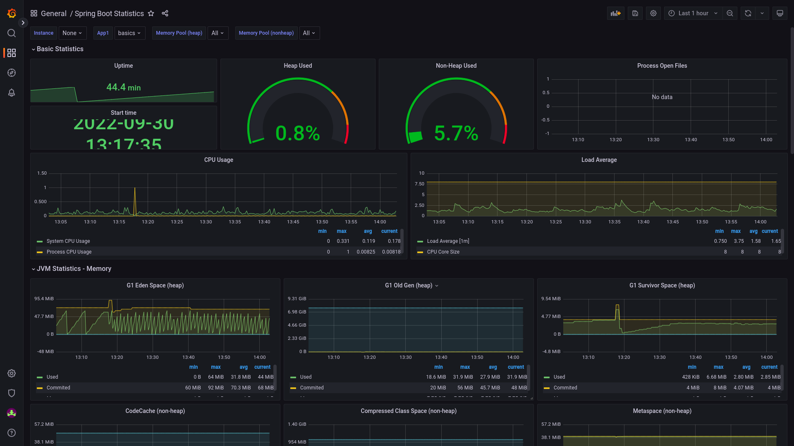
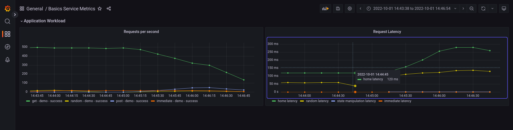

# Local Prometheus environment

## push gateway

prometheus actually likes reaching out himself.
but thats not easy from within a container.

Enter push gateway where you can POST your metrics,
for prometheus to pick up.

### the curl command 

```shell
while true; do curl -s -w '\n' http://localhost:8080/actuator/prometheus | curl -s --data-binary @- http://localhost:9091/metrics/job/some-label; sleep 5; done;
```

or set your vars:

```shell
a=demo # your app's name
p=8080 # your app's port
lh=http://localhost
```

and then run this:

```shell
while true; do curl -s -w '\n' ${lh}:$p/actuator/prometheus | curl -s --data-binary @- ${lh}:9091/metrics/job/${a}; sleep 5; done;
```

## dashboards

### Spring Boot statistics:



### Basics Service Metrics


